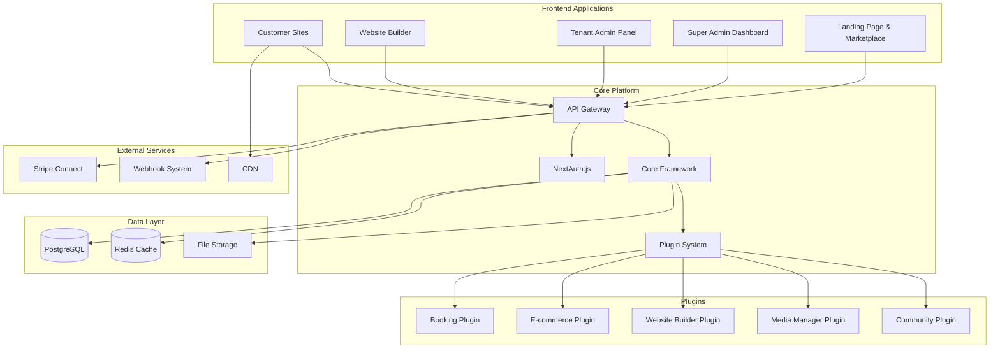

# BizBox Multi-Tenant Platform Design Document

## Overview

BizBox is a comprehensive SaaS platform designed as a revolutionary website builder and business management system for UK service-based businesses. The platform follows a plugin-first architecture within a monorepo structure, enabling modular development and easy extensibility. Built with Next.js, TypeScript, PostgreSQL, and Shadcn UI, BizBox provides three main interfaces: a modern landing page with marketplace, Super Admin dashboard, Tenant Admin panels, and dynamically generated customer websites.

## Architecture

### High-Level Architecture



### Monorepo Structure

```
packages/
├── core/
│   ├── framework/           # Core plugin framework
│   ├── database/           # Database utilities & migrations
│   ├── auth/               # NextAuth configuration
│   └── api/                # Core API routes
├── plugins/
│   ├── booking/            # Booking system plugin
│   ├── ecommerce/          # E-commerce plugin
│   ├── website-builder/    # Website builder plugin
│   ├── media-manager/      # Media management plugin
│   ├── community/          # Community & marketplace plugin
│   └── payments/           # Stripe integration plugin
├── shared/
│   ├── ui/                 # Shadcn UI components
│   ├── types/              # TypeScript definitions
│   ├── utils/              # Shared utilities
│   └── hooks/              # React hooks
├── apps/
│   ├── landing/            # Landing page & marketplace
│   ├── admin/              # Super Admin dashboard
│   ├── tenant/             # Tenant Admin panel
│   ├── builder/            # Website builder interface
│   └── customer/           # Customer site renderer
└── tools/
    ├── dev/                # Development tools
    ├── build/              # Build scripts
    └── deploy/             # Deployment utilities
```

## Components and Interfaces

### Core Framework Components

#### Plugin System
- **Plugin Registry**: Manages plugin lifecycle and dependencies
- **Event Bus**: Handles inter-plugin communication
- **Hook System**: Provides extension points for plugins
- **Permission Manager**: Enforces plugin-level security

#### Database Layer
- **Tenant Isolation**: Row-level security with automatic tenant filtering
- **Migration System**: Plugin-aware database migrations
- **Query Builder**: Tenant-scoped query interface
- **Connection Pool**: Optimized PostgreSQL connections

#### API Gateway
- **Route Registration**: Plugin-based route management
- **Authentication Middleware**: NextAuth.js integration
- **Rate Limiting**: Tenant-scoped API limits
- **Request Validation**: Zod-based input validation

### Plugin Components

#### Booking Plugin
```typescript
interface BookingPlugin {
  services: ServiceManager;
  staff: StaffManager;
  appointments: AppointmentManager;
  availability: AvailabilityCalculator;
  notifications: NotificationService;
}

class AvailabilityCalculator {
  calculateSlots(service: Service, staff: Staff[], date: Date): TimeSlot[];
  checkConflicts(appointment: Appointment): boolean;
  applyBufferTimes(service: Service, slot: TimeSlot): TimeSlot;
}
```

#### Website Builder Plugin
```typescript
interface WebsiteBuilderPlugin {
  pageManager: PageManager;
  componentLibrary: ComponentLibrary;
  themeEngine: ThemeEngine;
  templateSystem: TemplateSystem;
  previewRenderer: PreviewRenderer;
}

class ComponentLibrary {
  getComponents(category: ComponentCategory): Component[];
  renderComponent(component: Component, data: any): ReactElement;
  validateComponent(component: Component): ValidationResult;
}
```

#### E-commerce Plugin
```typescript
interface EcommercePlugin {
  productManager: ProductManager;
  inventoryTracker: InventoryTracker;
  cartService: CartService;
  checkoutProcessor: CheckoutProcessor;
  orderManager: OrderManager;
}

class CartService {
  addItem(tenantId: string, item: CartItem): Promise<Cart>;
  updateQuantity(cartId: string, itemId: string, quantity: number): Promise<Cart>;
  calculateTotals(cart: Cart): CartTotals;
}
```

### Frontend Applications

#### Tenant Admin Panel
- **Dashboard**: Business metrics and quick actions
- **Business Settings**: Company information and branding
- **Service Management**: Service catalog and pricing
- **Staff Management**: Staff profiles and scheduling
- **Booking Calendar**: Appointment management interface
- **Website Builder**: Integrated website creation tool
- **Media Library**: Asset management interface
- **Analytics**: Business performance insights

#### Website Builder Interface
- **Canvas**: Drag-and-drop page editor
- **Component Palette**: Categorized component library
- **Property Panel**: Component configuration interface
- **Preview Mode**: Real-time website preview
- **Template Gallery**: Industry-specific templates
- **Theme Editor**: TweakCN-powered styling
- **Section Library**: Saved section templates

#### Customer Website Renderer
- **Dynamic Routing**: Tenant-specific URL handling
- **Component Renderer**: Server-side component rendering
- **Theme Application**: Runtime theme injection
- **Booking Integration**: Embedded booking flows
- **E-commerce Integration**: Shopping cart and checkout
- **SEO Optimization**: Meta tags and structured data

## Data Models

### Core Entities

```typescript
// Tenant Model
interface Tenant {
  id: string;
  name: string;
  domain: string;
  plan: SubscriptionPlan;
  settings: TenantSettings;
  createdAt: Date;
  updatedAt: Date;
}

// User Model
interface User {
  id: string;
  tenantId: string;
  email: string;
  role: UserRole;
  profile: UserProfile;
  permissions: Permission[];
}

// Business Model
interface Business {
  tenantId: string;
  name: string;
  description: string;
  address: Address;
  contact: ContactInfo;
  branding: BrandingSettings;
  socialMedia: SocialMediaLinks;
  legalDocuments: LegalDocument[];
}
```

### Plugin-Specific Models

```typescript
// Booking Models
interface Service {
  id: string;
  tenantId: string;
  name: string;
  description: string;
  duration: number;
  price: number;
  bufferBefore: number;
  bufferAfter: number;
  requiredSkills: Skill[];
}

interface Staff {
  id: string;
  tenantId: string;
  name: string;
  email: string;
  skills: Skill[];
  availability: Availability[];
  image?: string;
}

interface Appointment {
  id: string;
  tenantId: string;
  customerId: string;
  serviceId: string;
  staffId: string;
  startTime: Date;
  endTime: Date;
  status: AppointmentStatus;
  notes?: string;
}

// E-commerce Models
interface Product {
  id: string;
  tenantId: string;
  name: string;
  description: string;
  price: number;
  variants: ProductVariant[];
  inventory: InventoryItem[];
  images: string[];
  categories: Category[];
}

// Website Builder Models
interface Page {
  id: string;
  tenantId: string;
  slug: string;
  title: string;
  sections: Section[];
  theme: Theme;
  isPublished: boolean;
}

interface Section {
  id: string;
  type: string;
  components: Component[];
  layout: LayoutConfig;
  styling: SectionStyle;
}

interface Component {
  id: string;
  type: ComponentType;
  props: ComponentProps;
  dataBinding?: DataBinding;
  styling: ComponentStyle;
}
```

### Database Schema Design

```sql
-- Core tenant isolation
CREATE POLICY tenant_isolation ON all_tables
  USING (tenant_id = current_setting('app.current_tenant')::uuid);

-- Example table with tenant isolation
CREATE TABLE services (
  id UUID PRIMARY KEY DEFAULT gen_random_uuid(),
  tenant_id UUID NOT NULL REFERENCES tenants(id),
  name VARCHAR(255) NOT NULL,
  description TEXT,
  duration INTEGER NOT NULL,
  price DECIMAL(10,2) NOT NULL,
  buffer_before INTEGER DEFAULT 0,
  buffer_after INTEGER DEFAULT 0,
  created_at TIMESTAMP DEFAULT NOW(),
  updated_at TIMESTAMP DEFAULT NOW()
);

-- Enable RLS
ALTER TABLE services ENABLE ROW LEVEL SECURITY;
```

## Error Handling

### Error Classification
- **Validation Errors**: Input validation failures
- **Authorization Errors**: Permission and access violations
- **Business Logic Errors**: Domain-specific rule violations
- **System Errors**: Infrastructure and external service failures
- **Plugin Errors**: Plugin-specific failures

### Error Response Format
```typescript
interface ErrorResponse {
  error: {
    code: string;
    message: string;
    details?: any;
    timestamp: string;
    requestId: string;
    tenantId?: string;
  };
}
```

### Error Handling Strategy
- **Graceful Degradation**: Core functionality continues when plugins fail
- **Circuit Breakers**: Prevent cascade failures in external services
- **Retry Logic**: Exponential backoff for transient failures
- **Error Boundaries**: React error boundaries for UI resilience
- **Logging**: Comprehensive error logging with context

## Testing Strategy

### Testing Pyramid

#### Unit Tests
- **Core Framework**: Plugin system, database utilities, auth
- **Plugin Logic**: Business rules, calculations, validations
- **Shared Components**: UI components, hooks, utilities
- **API Endpoints**: Route handlers, middleware, validation

#### Integration Tests
- **Plugin Integration**: Inter-plugin communication
- **Database Integration**: Multi-tenant data access
- **API Integration**: End-to-end API workflows
- **Authentication Flow**: NextAuth.js integration

#### End-to-End Tests
- **User Journeys**: Complete business workflows
- **Website Builder**: Page creation and publishing
- **Booking Flow**: Service booking and payment
- **Multi-tenant Isolation**: Data separation verification

### Testing Tools
- **Jest**: Unit and integration testing
- **React Testing Library**: Component testing
- **Playwright**: End-to-end testing
- **MSW**: API mocking
- **Testcontainers**: Database testing

### Plugin Testing Framework
```typescript
interface PluginTestSuite {
  setupTenant(): Promise<Tenant>;
  cleanupTenant(tenantId: string): Promise<void>;
  mockExternalServices(): void;
  assertTenantIsolation(test: () => Promise<void>): Promise<void>;
}
```

## Security Architecture

### Multi-Tenant Security
- **Row-Level Security**: Database-level tenant isolation
- **API Middleware**: Automatic tenant context injection
- **Session Management**: Tenant-scoped user sessions
- **Resource Access**: Tenant-aware permission checking

### Authentication & Authorization
- **NextAuth.js**: Secure session management
- **JWT Tokens**: Stateless authentication
- **Role-Based Access**: Hierarchical permission system
- **API Keys**: Programmatic access for integrations

### Data Protection
- **Encryption at Rest**: Database and file storage encryption
- **Encryption in Transit**: TLS for all communications
- **PII Handling**: GDPR-compliant data processing
- **Audit Logging**: Comprehensive activity tracking

### Plugin Security
- **Sandboxing**: Plugin execution isolation
- **Permission System**: Granular plugin permissions
- **Code Validation**: Plugin manifest validation
- **Security Scanning**: Automated vulnerability detection

## Performance Optimization

### Caching Strategy
- **Redis Cache**: Session and frequently accessed data
- **CDN**: Static assets and customer websites
- **Database Query Cache**: Optimized query results
- **Component Cache**: Pre-rendered website components

### Database Optimization
- **Connection Pooling**: Efficient database connections
- **Query Optimization**: Indexed tenant-scoped queries
- **Read Replicas**: Scaled read operations
- **Partitioning**: Large table performance optimization

### Frontend Performance
- **Code Splitting**: Lazy-loaded plugin interfaces
- **Image Optimization**: Automatic image processing
- **Bundle Optimization**: Tree-shaking and minification
- **Progressive Loading**: Skeleton screens and lazy loading

### Monitoring & Observability
- **Application Metrics**: Performance and usage tracking
- **Error Tracking**: Real-time error monitoring
- **Database Monitoring**: Query performance analysis
- **Plugin Metrics**: Individual plugin performance

## Deployment Architecture

### Infrastructure
- **Container Orchestration**: Docker with Kubernetes
- **Load Balancing**: Multi-instance application deployment
- **Database Clustering**: PostgreSQL high availability
- **File Storage**: S3-compatible object storage

### CI/CD Pipeline
- **Monorepo Builds**: Selective package building
- **Automated Testing**: Full test suite execution
- **Security Scanning**: Vulnerability assessment
- **Deployment Automation**: Zero-downtime deployments

### Environment Management
- **Development**: Local development with Docker Compose
- **Staging**: Production-like testing environment
- **Production**: High-availability production deployment
- **Plugin Environments**: Isolated plugin development

This design document provides a comprehensive foundation for building BizBox as a revolutionary, plugin-based SaaS platform that can scale from initial launch to a thriving ecosystem of business tools and community features.